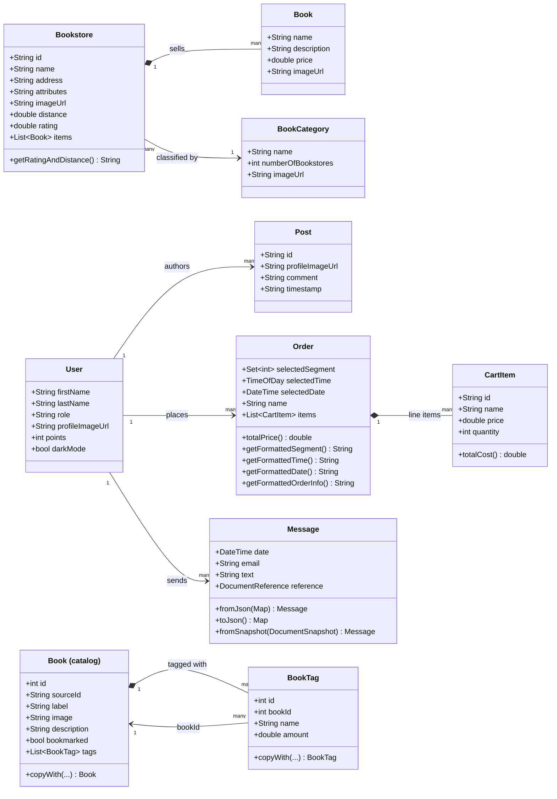
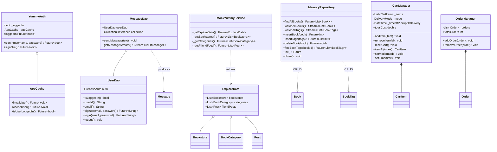
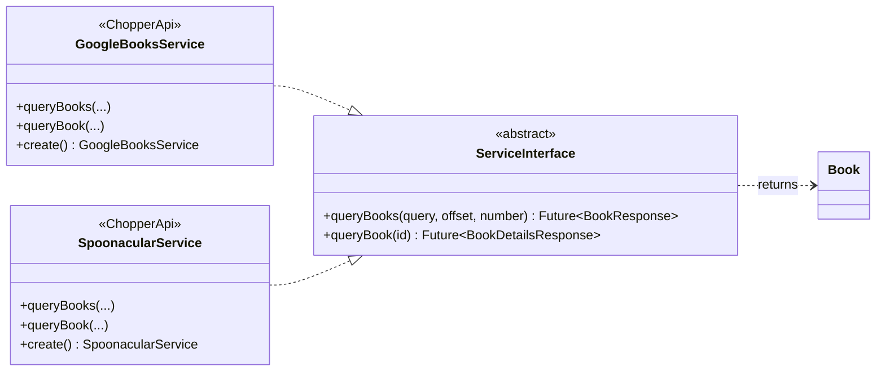
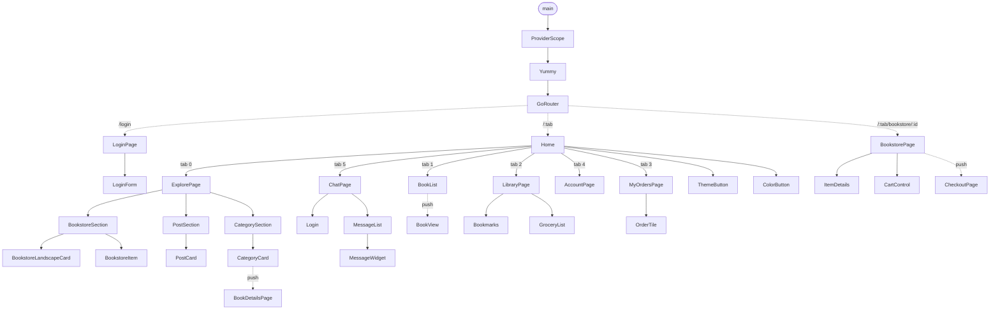
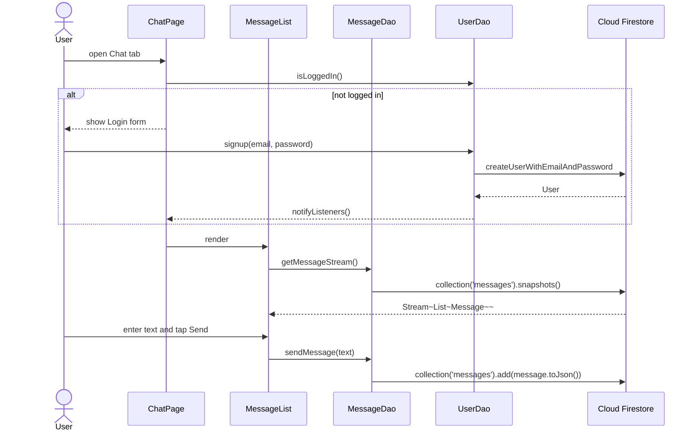

# Architecture — Functions & Widgets

This document is a structural map of the **Yummy** Flutter application (an
online bookstore). It is derived from the actual source under `lib/` and is
intended to be read as the counterpart of the ER diagram from the previous
assignment: every entity in the ER diagram appears here as a Dart class, and
the widget tree shows where each entity is rendered.

All diagrams below are written in [Mermaid](https://mermaid.live) — GitHub
renders them automatically in the file preview, and you can also paste any of
them into <https://mermaid.live> to export PNG/SVG.

---

## 1. Layered overview

```mermaid
flowchart LR
    subgraph Domain["Domain models (ER entities)"]
        direction TB
        Bookstore
        Book
        BookCategory
        Post
        User
        CartItem
        Order
        Message
        CatalogBook["Book (catalog)"]
        BookTag
    end

    subgraph State["State / managers / DAOs"]
        direction TB
        CartManager
        OrderManager
        YummyAuth
        AppCache
        UserDao
        MessageDao
        MemoryRepository
        MockYummyService
    end

    subgraph Network["Network (Chopper services)"]
        direction TB
        ServiceInterface
        GoogleBooksService
        SpoonacularService
    end

    subgraph UI["UI (widgets / screens)"]
        direction TB
        Yummy
        LoginPage
        Home
        ExplorePage
        BookList
        LibraryPage
        MyOrdersPage
        AccountPage
        ChatPage
        BookstorePage
        CheckoutPage
        BookDetailsPage
        BookView
        Bookmarks
        GroceryList
    end

    UI --> State
    State --> Domain
    UI --> Network
    Network --> Domain
```



---

## 2. Entity-relationship class diagram

This is the Dart-class translation of the ER diagram. Multiplicities mirror the
ER relationships (1 — N, N — M).



> **Mapping to the ER diagram**
>
> | ER entity         | Dart class                              |
> | ----------------- | --------------------------------------- |
> | Bookstore         | `Bookstore` (`lib/models/bookstore.dart`)|
> | Catalog item      | `Book` (`lib/models/bookstore.dart`)    |
> | Genre / Category  | `BookCategory`                          |
> | User              | `User` + `UserDao` record               |
> | Post / Feed item  | `Post`                                  |
> | Cart line         | `CartItem`                              |
> | Order             | `Order`                                 |
> | Chat message      | `Message`                               |
> | Book (library)    | `Book` (`lib/data/models/book.dart`)    |
> | Tag               | `BookTag`                               |

Note: there are two `Book` classes in the codebase that live in different
namespaces — `lib/models/bookstore.dart` defines the lightweight catalog item
shown inside a bookstore, while `lib/data/models/book.dart` defines the richer
entity returned by the Google Books / Spoonacular search APIs and persisted in
the in-memory library. They are intentionally separated because they have
different fields (`price`/`imageUrl` vs `sourceId`/`bookmarked`/`tags`).

---

## 3. State, services and DAOs

These classes own application state and mediate between widgets and the data
sources (Firebase, in-memory mock, Chopper REST services, SharedPreferences).



---

## 4. Network layer (Chopper)



---

## 5. Widget tree

This flowchart shows how widgets are composed at runtime, starting from `main()`
and `Yummy` (the root `MaterialApp.router`). Solid arrows mean *renders a
child*; dashed arrows mean *navigates to* (via `GoRouter`).



---

## 6. End-to-end data flow for the "Chat" feature

A concrete example of how the layers interact for a single user action
(sending a chat message):



---

## How to update this document

If a new model, manager, or screen is added:

1. Add the class to the relevant Mermaid block above.
2. Draw an arrow to the closest collaborator (avoid hub-and-spoke spaghetti —
   prefer one or two strong relationships per class).
3. Open the file on GitHub to verify the diagram still renders, or paste each
   ` ```mermaid` block into <https://mermaid.live>.
